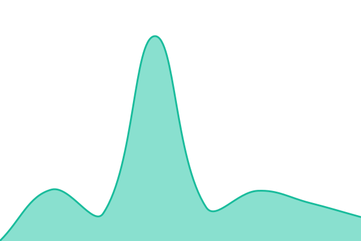

# [📈 Live Status](https://status.vestal.tk): <!--live status--> **🟩 All systems operational**

This repository contains the open-source uptime monitor and status page for [Upptime](https://upptime.js.org), powered by [Upptime](https://github.com/upptime/upptime).

With [Upptime](https://upptime.js.org), you can get your own unlimited and free uptime monitor and status page, powered entirely by a GitHub repository. We use [Issues](https://github.com/upptime/upptime/issues) as incident reports, [Actions](https://github.com/Sid220/server-status/actions) as uptime monitors, and [Pages](https://status.vestal.tk) for the status page.

<!--start: status pages-->
<!-- This summary is generated by Upptime (https://github.com/upptime/upptime) -->
<!-- Do not edit this manually, your changes will be overwritten -->
<!-- prettier-ignore -->
| URL | Status | History | Response Time | Uptime |
| --- | ------ | ------- | ------------- | ------ |
|  [Portfolio](https://sidtrz.com) | 🟩 Up | [portfolio.yml](https://github.com/Sid220/server-status/commits/HEAD/history/portfolio.yml) | 

 2993ms
     
 | 

<a href="https://status.sidtrz.com/history/portfolio">99.56%</a>
    

|  [VirtualBox Icons for HTML Documentation](https://vi.sidtrz.com) | 🟩 Up | [virtual-box-icons-for-html-documentation.yml](https://github.com/Sid220/server-status/commits/HEAD/history/virtual-box-icons-for-html-documentation.yml) | 

 261ms
     
 | 

<a href="https://status.sidtrz.com/history/virtual-box-icons-for-html-documentation">100.00%</a>
    

|  [Now](https://now.sidtrz.com) | 🟩 Up | [now.yml](https://github.com/Sid220/server-status/commits/HEAD/history/now.yml) | 

 222ms
     
 | 

<a href="https://status.sidtrz.com/history/now">99.65%</a>
    

|  [WinterWonderland](https://winterwonderland.sidtrz.com) | 🟩 Up | [winter-wonderland.yml](https://github.com/Sid220/server-status/commits/HEAD/history/winter-wonderland.yml) | 

 431ms
     
 | 

<a href="https://status.sidtrz.com/history/winter-wonderland">99.74%</a>
    

|  [CDN](https://cdn.sidtrz.com/public) | 🟩 Up | [cdn.yml](https://github.com/Sid220/server-status/commits/HEAD/history/cdn.yml) | 

 181ms
     
 | 

<a href="https://status.sidtrz.com/history/cdn">100.00%</a>
    

|  [Gitlab](https://git.sidtrz.com/) | 🟩 Up | [gitlab.yml](https://github.com/Sid220/server-status/commits/HEAD/history/gitlab.yml) | 

 411ms
     
 | 

<a href="https://status.sidtrz.com/history/gitlab">100.00%</a>
    

<!--end: status pages-->

[**Visit our status website →**](https://status.vestal.tk)

## 📄 License

- Powered by: [Upptime](https://github.com/upptime/upptime)
- Code: [MIT](./LICENSE) © [Upptime](https://upptime.js.org)
- Data in the `./history` directory: [Open Database License](https://opendatacommons.org/licenses/odbl/1-0/)
