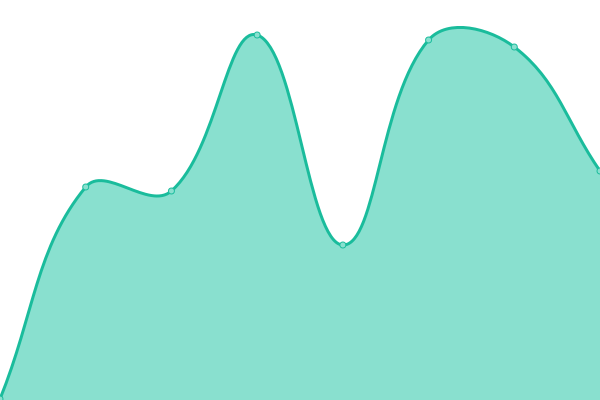

# [📈 Live Status](https://status.vestal.tk): <!--live status--> **🟩 All systems operational**

This repository contains the open-source uptime monitor and status page for [Upptime](https://upptime.js.org), powered by [Upptime](https://github.com/upptime/upptime).

With [Upptime](https://upptime.js.org), you can get your own unlimited and free uptime monitor and status page, powered entirely by a GitHub repository. We use [Issues](https://github.com/upptime/upptime/issues) as incident reports, [Actions](https://github.com/Sid220/server-status/actions) as uptime monitors, and [Pages](https://status.vestal.tk) for the status page.

<!--start: status pages-->
<!-- This summary is generated by Upptime (https://github.com/upptime/upptime) -->
<!-- Do not edit this manually, your changes will be overwritten -->
<!-- prettier-ignore -->
| URL | Status | History | Response Time | Uptime |
| --- | ------ | ------- | ------------- | ------ |
|  [Plios](https://plios.tech) | 🟩 Up | [plios.yml](https://github.com/Sid220/server-status/commits/HEAD/history/plios.yml) | 

 1045ms
     
 | 

<a href="https://status.plios.tech/history/plios">99.01%</a>
    

|  [SmartDisplayPi Backend](https://backend-sdp.plios.tech) | 🟩 Up | [smart-display-pi-backend.yml](https://github.com/Sid220/server-status/commits/HEAD/history/smart-display-pi-backend.yml) | 

 887ms
     
 | 

<a href="https://status.plios.tech/history/smart-display-pi-backend">99.38%</a>
    

|  [SmartDisplayPi Documentation](https://docs-sdp.plios.tech) | 🟩 Up | [smart-display-pi-documentation.yml](https://github.com/Sid220/server-status/commits/HEAD/history/smart-display-pi-documentation.yml) | 

 1088ms
     
 | 

<a href="https://status.plios.tech/history/smart-display-pi-documentation">100.00%</a>
    

|  [Quotes API](https://quotes-api.plios.tech) | 🟩 Up | [quotes-api.yml](https://github.com/Sid220/server-status/commits/HEAD/history/quotes-api.yml) | 

 480ms
     
 | 

<a href="https://status.plios.tech/history/quotes-api">99.77%</a>
    

|  [VirtualBox Icons for HTML Documentation](https://vi.plios.tech) | 🟩 Up | [virtual-box-icons-for-html-documentation.yml](https://github.com/Sid220/server-status/commits/HEAD/history/virtual-box-icons-for-html-documentation.yml) | 

 178ms
     
 | 

<a href="https://status.plios.tech/history/virtual-box-icons-for-html-documentation">100.00%</a>
    

|  [WinterWonderland](https://winterwonderland.plios.tech) | 🟩 Up | [winter-wonderland.yml](https://github.com/Sid220/server-status/commits/HEAD/history/winter-wonderland.yml) | 

 767ms
     
 | 

<a href="https://status.plios.tech/history/winter-wonderland">99.77%</a>
    

<!--end: status pages-->

[**Visit our status website →**](https://status.vestal.tk)

## 📄 License

- Powered by: [Upptime](https://github.com/upptime/upptime)
- Code: [MIT](./LICENSE) © [Upptime](https://upptime.js.org)
- Data in the `./history` directory: [Open Database License](https://opendatacommons.org/licenses/odbl/1-0/)
